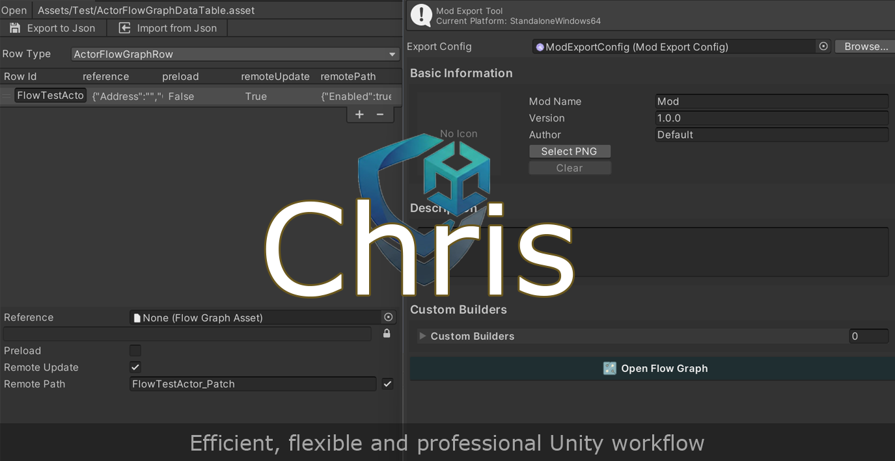
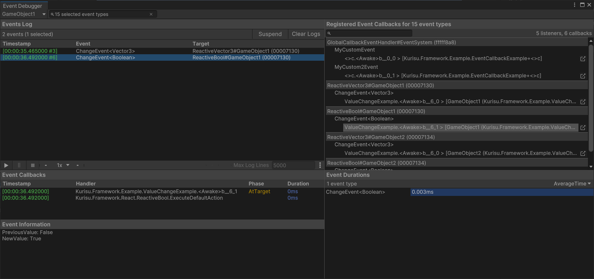
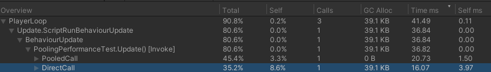
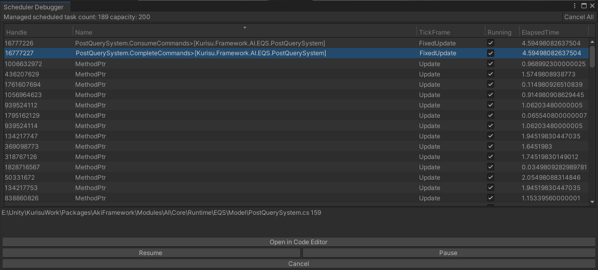
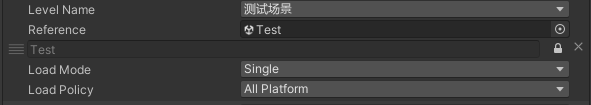
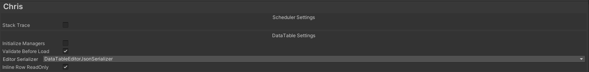
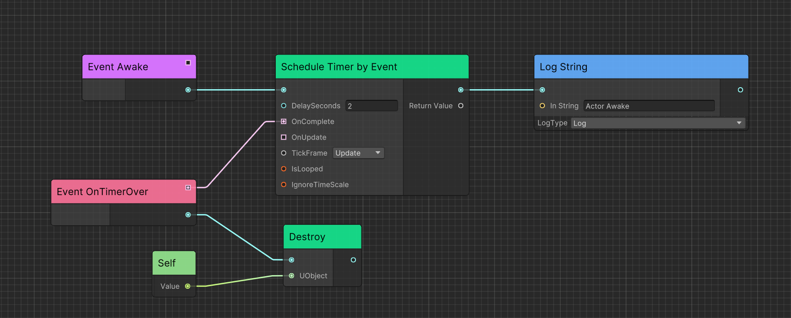

<div align="center">

[](https://deepwiki.com/AkiKurisu/Chris)
[](https://www.zhihu.com/people/akikurisu)
[](https://space.bilibili.com/20472331)

# Chris

Un marco de desarrollo para Unity diseñado para flujos de trabajo eficientes, flexibles y profesionales.



</div>

## Dependencias

1. Agrega las siguientes dependencias a `manifest.json`.

```json
"dependencies": {
    "com.cysharp.unitask":"https://github.com/Cysharp/UniTask.git?path=src/UniTask/Assets/Plugins/UniTask"
  }
```

2. Instala `R3` desde NuGet utilizando NuGetForUnity. Abre la ventana desde NuGet -> Manage NuGet Packages, busca "R3" y presiona Install.

3. Usa la URL de git para descargar el paquete a través del Unity Package Manager ```https://github.com/AkiKurisu/Chris.git```.

## Características Principales

[Events](./Documentation~/Events.md) 
> Una solución de eventos potente para el manejo dinámico y contextual de eventos, adaptada de UIElement.



[Pool](./Documentation~/Pool.md) 
> Reutilización (pooling) de GameObject/Component sin asignación de memoria. 



[Schedulers](./Documentation~/Schedulers.md) 
> Temporizador y contador de frames sin asignación de memoria. 



[Serialization](./Documentation~/Serialization.md)
> Herramienta de serialización potente para el flujo de trabajo.


[Resource](./Documentation~/Resource.md) 
> Sistema de carga de recursos basado en Addressables. 



[Data Driven](./Documentation~/DataDriven.md)
> Utiliza un flujo de trabajo con DataTables similar al de Unreal en Unity.


[Configs](./Documentation~/Configs.md)
> Sistema de gestión de configuración global con organización jerárquica y serialización automática.



[Console Variables](./Documentation~/Configs.md#console-variables)
> Ajuste de configuración en tiempo de ejecución a través de comandos de consola en el juego.


[Tasks](./Documentation~/Tasks.md)
> Sistema de tareas asíncronas con prerrequisitos y finalización impulsada por eventos.

[Modules](./Documentation~/Modules.md)
> Sistema de carga de módulos en tiempo de ejecución para una arquitectura modular.

### Módulo de Gameplay

[Gameplay](./Documentation~/Gameplay.md)

> Arquitectura de jugabilidad basada en Actores similar a Unreal, integra Ceres para soportar scripting visual.
>
> Para integrar Ceres, agrega las siguientes dependencias a `manifest.json`.

```json
"dependencies": {
    "com.kurisu.ceres":"https://github.com/AkiKurisu/Ceres.git"
  }
```



[AI](./Documentation~/AI.md)

> Herramientas de IA basadas en investigaciones de juegos AAA. 


### [Mod](./Documentation~/Mod.md) 

Flujo de trabajo para modificación de assets basado en Addressables.

## Wiki

[Chris Wiki](https://deepwiki.com/AkiKurisu/Chris/) generada por [DeepWiki](https://deepwiki.com).

## Créditos

[Cysharp/R3](https://github.com/Cysharp/R3)

[Cysharp/UniTask](https://github.com/Cysharp/UniTask)

[Unity/UIElements](https://github.com/Unity-Technologies/UnityCsReference/tree/2022.3/ModuleOverrides/com.unity.ui/Core)

[akbiggs/Unity Timer](https://github.com/akbiggs/UnityTimer)

[yasirkula/UnityIngameDebugConsole](https://github.com/yasirkula/UnityIngameDebugConsole)

[yasirkula/NativeGallery](https://github.com/yasirkula/UnityNativeGallery)

## Licencia

MIT
