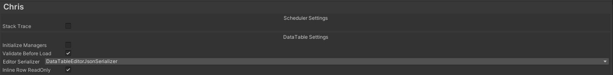
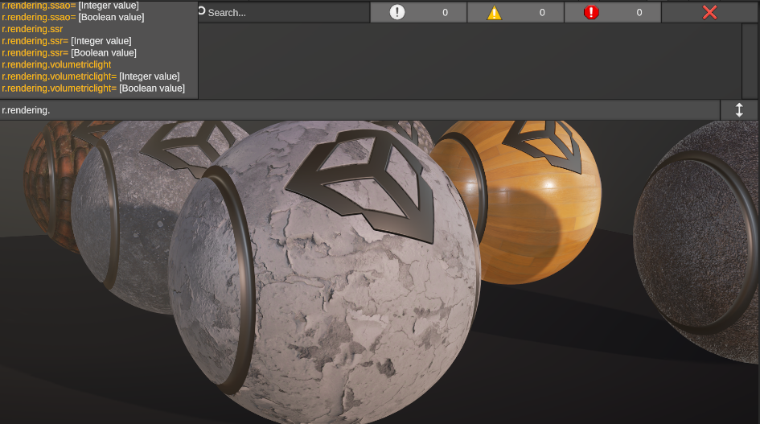

<div align="center">

# Chris

A Unity development framework designed for efficient, flexible and professional workflows.

</div>


## Dependencies

Add following dependencies to `manifest.json`.

```json
"dependencies": {
    "com.cysharp.unitask":"https://github.com/Cysharp/UniTask.git?path=src/UniTask/Assets/Plugins/UniTask"
  }
```

Use git URL to download package by Unity Package Manager ```https://github.com/AkiKurisu/Chris.git```.

## Core Features

[Events](./Documentation~/Events.md) 
> A powerful event solution for dynamic and contextual event handling ported from UIElement.


[Pool](./Documentation~/Pool.md) 
> Zero allocation GameObject/Component pooling. 


[Schedulers](./Documentation~/Schedulers.md) 
> Zero allocation timer/frame counter. 


[Serialization](./Documentation~/Serialization.md)
> Powerful serialization tool for workflow.


[Resource](./Documentation~/Resource.md) 
> Resource loading system based on Addressables. 


[Data Driven](./Documentation~/DataDriven.md)
> Use Unreal-like DataTable workflow in Unity.


[Configs](./Documentation~/Configs.md)
> Global configuration management system with hierarchical organization and automatic serialization.



[Console Variables](./Documentation~/Configs.md#console-variables)
> Runtime configuration adjustment through in-game console commands.



[Tasks](./Documentation~/Tasks.md)
> Asynchronous task system with prerequisites and event-driven completion.

[Modules](./Documentation~/Modules.md)
> Runtime module loading system for modular architecture.

### Gameplay Module

[Gameplay](./Documentation~/Gameplay.md)

> Actor based gameplay architecture like Unreal, integrate Ceres to support visual scripting.
>
> To integrate Ceres, add following dependencies to the `manifest.json`.

```json
"dependencies": {
    "com.kurisu.ceres":"https://github.com/AkiKurisu/Ceres.git"
  }
```


[AI](./Documentation~/AI.md)

> AI tools from AAA games research. 


### [Mod](./Documentation~/Mod.md) 

Asset modding workflow based on Addressables.

## Wiki

[Chris Wiki](https://deepwiki.com/AkiKurisu/Chris/) generated by [DeepWiki](https://deepwiki.com).

## Credits

[Cysharp/R3](https://github.com/Cysharp/R3)

[Cysharp/UniTask](https://github.com/Cysharp/UniTask)

[Unity/UIElements](https://github.com/Unity-Technologies/UnityCsReference/tree/2022.3/ModuleOverrides/com.unity.ui/Core)

[akbiggs/Unity Timer](https://github.com/akbiggs/UnityTimer)

[yasirkula/UnityIngameDebugConsole](https://github.com/yasirkula/UnityIngameDebugConsole)

[yasirkula/NativeGallery](https://github.com/yasirkula/UnityNativeGallery)

## License

MIT
