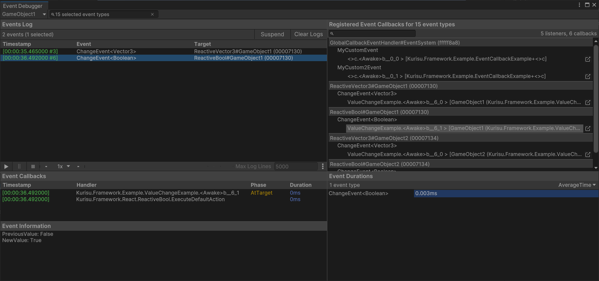
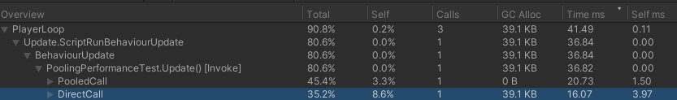
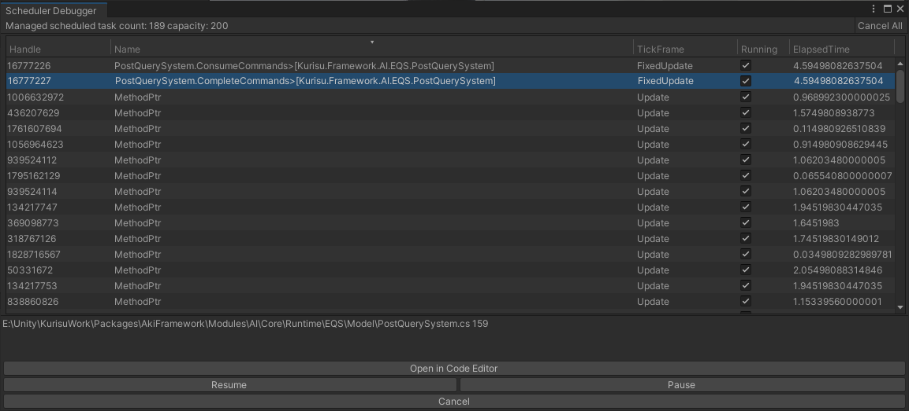
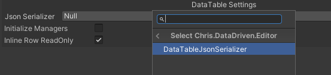
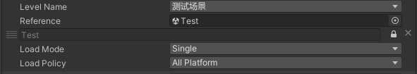
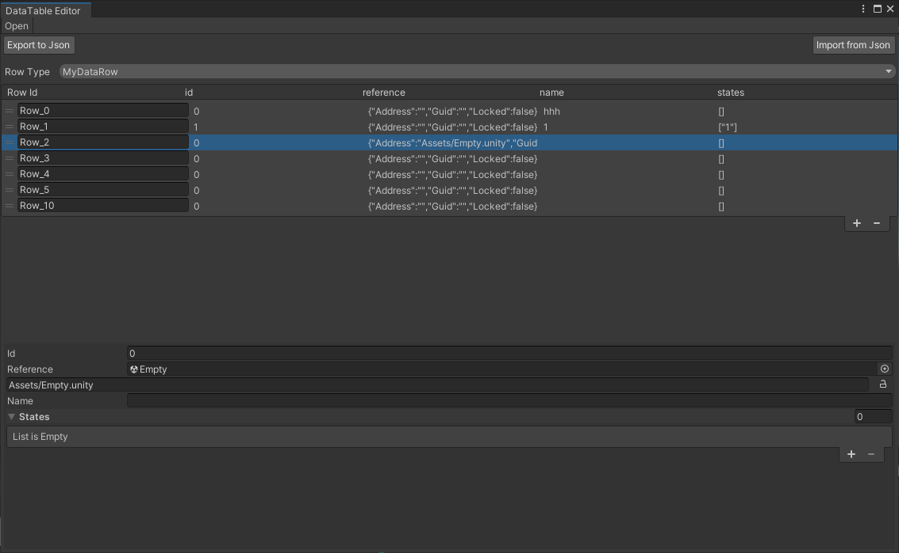

<div align="center">

# Chris

A Unity game framework designed for efficient development.

</div>

## Install

Use git URL to download package by Unity Package Manager ```https://github.com/AkiKurisu/Chris.git```.

## Core Features

[Events](./Documentation~/Events.md) 
> A powerful event solution for dynamic and contextual event handling ported from UIElement.



[Pool](./Documentation~/Pool.md) 
> Zero allocation GameObject/Component pooling. 



[Schedulers](./Documentation~/Schedulers.md) 
> Zero allocation timer/frame counter. 



[Serialization](./Documentation~/Serialization.md)
> Powerful serialization tool for workflow.



[Resource](./Documentation~/Resource.md) 
> Resource loading system based on Addressables. 



[Data Driven](./Documentation~/DataDriven.md)
>Use Unreal-like DataTable workflow in Unity.



## Dependencies

```json
"dependencies": {
    "com.cysharp.unitask":"https://github.com/Cysharp/UniTask.git?path=src/UniTask/Assets/Plugins/UniTask",
    "com.unity.addressables": "1.21.0",
    "com.unity.nuget.newtonsoft-json": "3.2.1",
    "com.unity.collections": "2.2.1",
    "com.unity.burst": "1.8.9",
    "com.unity.mathematics": "1.3.1"
  }
```

## Reference

[R3](https://github.com/Cysharp/R3)

[UniTask](https://github.com/Cysharp/UniTask)

[Unity.UIElements](https://github.com/Unity-Technologies/UnityCsReference/tree/2022.3/ModuleOverrides/com.unity.ui/Core)

[Unity Timer](https://github.com/akbiggs/UnityTimer)

## License

MIT